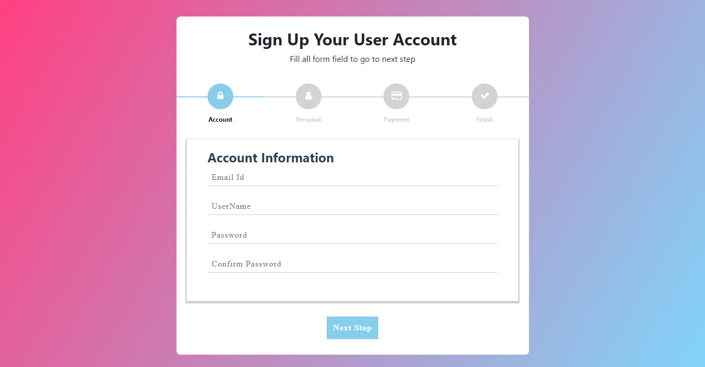
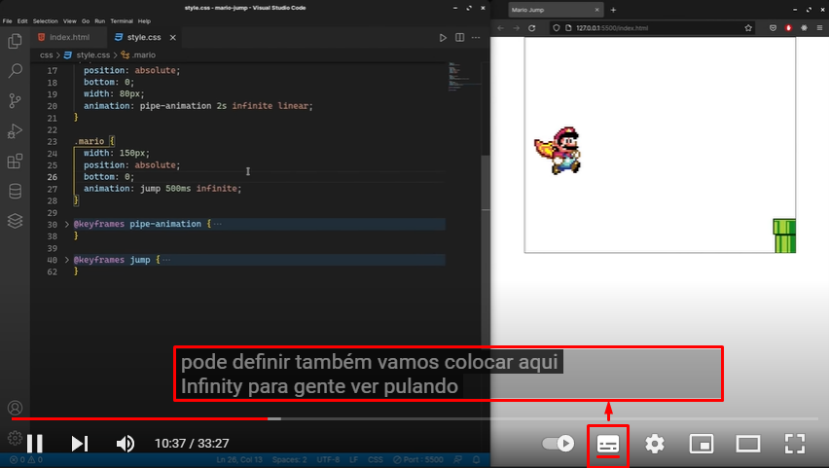
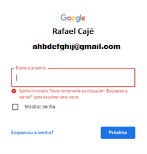

<h1 align=center> RAFAEL PINTO CAJÉ</h1>

<h1 align="">Avaliação Heurística - IHC (Interação Humano Computador)
3ºS ADS</h1>

### Professor BERTOTI

## Análise heurística (WCAG/W3C)
A análise heurística é uma espécie de “inspeção” de usabilidade. Consiste em avaliar uma interface para determinar se obedece a princípios pré-determinados – as heurísticas.

## SUMÁRIO
- [STACK](#Stack)
- [YOUTUBE](#Youtube)
- [RIOTGAMES](#Riot_Games)
- [SABESP](#Sabesp)
- [GMAIL](#Gmail)
- [NETFLIX](#Netflix)
- [CONVULSÕES](#Convulsões_e_Reações_Físicas)

<h3>1 - NAVEGÁVEL</h3>
Forneça maneiras de ajudar o usuário a navegar, encontrar conteúdo e determinar os passos seguintes para chegar ao seu objetivo.

Exemplo de formulário navegável:

    

<h3>2 - DESCRIÇÃO DE ÁUDIO (Pré-gravada) </h3>

A descrição de áudio é fornecida para todo o conteúdo de vídeo pré-gravado em mídia sincronizada.
Auxilia pessoas com déficit auditivo.

  

<h3>3 - DISTINGUÍVEL</h3>
Faça com que seja simples para o seu usuário VER e OUVIR o conteúdo, incluindo a distinção do primeiro plano do plano de fundo.

Distinguível:

  

NÃO distinguível:

  
   
  <h4>Nessa parte da página home o branco do notebook da imagem NÃO se distingue do fundo branco da página, encontrada no site da Sabesp.</h4>

<h3>4 - ERRO DE IDENTIFICAÇÃO (NÍVEL A)</h3>

Se um erro de entrada for detectado automaticamente, o item que está com erro é identificado e o erro é descrito para o usuário em texto.
Cadastro eficiente, para que seja evitado a introdução de dados incorretos.

 

<h3>5 - TEMPO LIMITE</h3>
Permita que os conteúdos sejam exibidos exibidos na tela por tempo suficiente para que possam ser lidos. Exemplo de uso no aplitivo VLC MEDIA PLAYER para assistir videos e filmes.

### Tempo limite Nível AAA
Os usuários são avisados sobre a duração de qualquer inatividade do usuário que possa causar perda de dados, a menos que os dados sejam preservados por mais de 20 horas quando o usuário não realizar nenhuma ação.

A Netflix pergunta: "Você ainda está assistindo...?" para que você não perca seu lugar ou use dados da Internet quando não estiver assistindo a um programa de TV ou filme. O prompt aparece:

- Depois de assistir a 3 episódios de um programa de TV seguidos sem usar nenhum controle do reprodutor de vídeo ou

- Após 90 minutos de observação ininterrupta

Para continuar assistindo, você pode dispensar a mensagem ou desativar a reprodução automática do próximo episódio .

  

<h3>6 - CONVULSÕES E REAÇÕES FÍSICAS</h3>
A epilepsia fotossensível é uma condição em que as convulsões são desencadeadas por luzes intermitentes ou padrões contrastantes de luz e escuridão. Tendo em mente essa condição o uso de luzes e super-estímulos vizuais devem ser evitados, caso não seja posível devemos aletar o usuário antes que ele seja exposto a esse típo de conteúdo.
